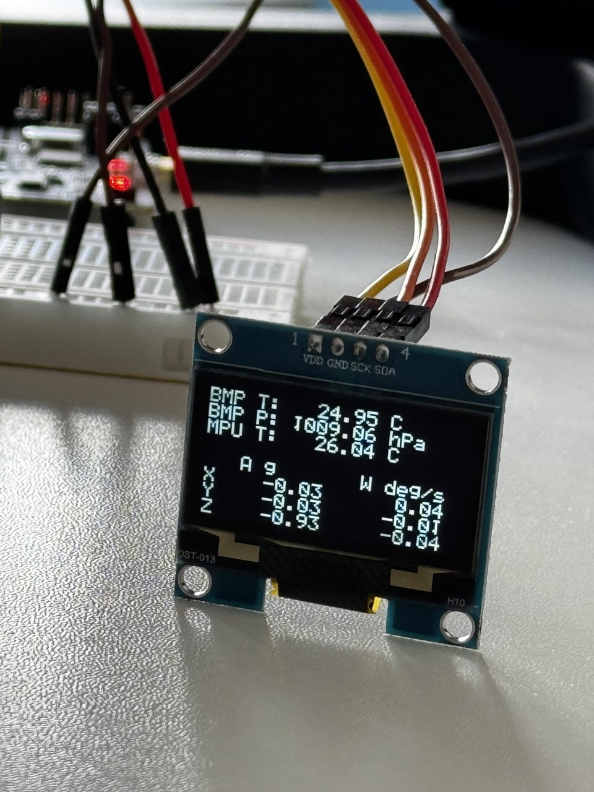

# Stm32SensorHub

Bare-metal C++20 firmware for the STM32 NUCLEO-F401RE.

The project demonstrates direct STM32 peripheral control, environmental and
motion sensor acquisition, and graphical OLED output without HAL, an RTOS,
or an operating system.

MCU peripherals are controlled through memory-mapped registers.

The firmware includes custom peripheral drivers, hardware-independent sensor
algorithms, native unit tests, I2C bus recovery, and a lightweight graphics
system for an SH1106 OLED display.

## Live Sensor Dashboard

The STM32 Sensor Hub now displays live environmental measurements
on a 1.30-inch SH1106 OLED display.



The dashboard displays:

- BMP280 temperature in degrees Celsius
- Atmospheric pressure in hPa
- Sensor identification
- STM32 Sensor Hub header

Measurements are updated every second using the existing
SysTick-based sampling schedule.

The OLED operates independently of the development computer.
USART2 remains available for serial diagnostics.

## Hardware

### Development board

- STM32 NUCLEO-F401RE
- STM32F401RE Cortex-M4 microcontroller
- 512 KiB Flash
- 96 KiB SRAM
- Integrated ST-LINK/V2.1 debugger

### Connected devices

| Device | Function | Interface | Address |
|--------|----------|-----------|---------|
| BMP280 | Temperature and atmospheric pressure | I2C1 | `0x76` |
| MPU-6050 | Acceleration, temperature, angular velocity | I2C1 | `0x68` |
| SH1106 OLED | 128×64 monochrome graphical display | I2C1 | `0x3C` |

Additional hardware:

- Breadboard
- Dupont wires
- USB connection for flashing and serial diagnostics

## Current milestone

Implemented and verified on physical hardware:

### Platform and peripherals

- ARM GCC cross-compilation with CMake and Ninja
- Custom startup code and interrupt vector table
- Custom linker script
- Flash and RAM initialization
- Global C++ constructor initialization
- Cortex-M4 floating-point unit initialization
- ST-LINK/SWD flashing through OpenOCD
- GPIO output for the onboard LD2 LED on PA5
- USART2 transmission at 115200 baud
- Bare-metal I2C1 initialization
- Structured MCU register-access layer
- Minimal bare-metal system-call stubs
- Separate ELF segments for executable Flash and writable RAM

### I2C communication

- I2C address probing
- Optional compile-time I2C bus scanner
- Single-byte register reads
- Multi-byte register reads
- Single-byte register writes
- Generic multi-byte I2C transmission
- Dedicated STM32F4 receive sequences for one, two, and multiple bytes
- Bounded polling and timeout handling
- Status-register diagnostics
- Automatic recovery from a stuck I2C bus
- GPIO-based recovery using up to nine SCL clock pulses
- Manual STOP generation during bus recovery
- I2C1 peripheral reinitialization after recovery
- Runtime I2C recovery diagnostics
- Physical stuck-SDA fault testing

### Environmental and motion sensors

- BMP280 detection and chip ID verification
- BMP280 measurement-mode initialization
- Factory-calibration reading and decoding
- Temperature and pressure compensation
- MPU-6050 identity verification
- MPU-6050 wake-up and power-state verification
- Accelerometer, temperature, and gyroscope reading
- Conversion of raw measurements into physical units
- Gyroscope zero-rate offset calibration
- Runtime gyroscope bias compensation
- Periodic sensor sampling

### USART2 console milestone

- Interrupt-driven USART2 TX and RX with ring buffers
- Echo for bytes other than command characters
- Single-character commands: `p` (pause/resume), `s` (single sample), `d` (diagnostics)
- Command processing in the main loop, with at most 32 received bytes per iteration
- TX/RX dropped-byte, hardware RX overrun, and I2C recovery counters
- Echo and all three commands verified on NUCLEO-F401RE

See [Serial console](#serial-console) for usage and verification steps.

### Scheduling

- SysTick-based millisecond timekeeping
- One-second sensor sampling
- Absolute-time sampling schedule
- Cortex-M4 `WFI` sleep between interrupts
- LED heartbeat on the sampling schedule, continuing while reporting is paused

### OLED and graphics

- SH1106 OLED detection at I2C address `0x3C`
- SH1106 initialization and display control
- Generic I2C command and data transmission
- 128×64 monochrome framebuffer
- Individual pixel drawing
- Page-based OLED memory addressing
- SH1106 column-offset handling
- Chunked framebuffer transmission
- Custom 5×7 bitmap font
- Uppercase and lowercase Latin alphabet
- Numeric glyphs and space
- Text rendering with display-boundary checking
- Physical verification of graphical and text output

### Live sensor dashboard

- Custom floating-point number formatting without `sprintf`
- Fixed-point formatting with two decimal places
- Buffer-size validation and invalid-value handling
- 13 native GoogleTest cases for number formatting
- Dedicated sensor dashboard rendering
- Live BMP280 temperature and pressure visualization
- Shared measurements for OLED and USART2 output
- Periodic OLED framebuffer updates every second
- Physical verification on NUCLEO-F401RE

### Architecture and testing

- Shared hardware-independent sensor byte-decoding utilities
- Hardware-independent BMP280 compensation implementation
- Native host-side C++ test build with GoogleTest and CTest
- Unit tests for little-endian, big-endian, and 20-bit sensor decoding
- BMP280 compensation tests using reference values
- Hardware-independent I2C bus abstraction
- Dependency injection of the production STM32 I2C1 implementation
- Host-side mock I2C bus
- BMP280 and MPU-6050 driver tests
- Sensor-driver I2C failure-path testing
- MPU-6050 register-write verification
- Number formatting tests

## Hardware connections

BMP280, MPU-6050, and SH1106 share the same I2C1 bus.

| Nucleo pin | MCU pin | Signal | BMP280 | MPU-6050 | OLED |
|------------|---------|--------|--------|----------|------|
| `3V3` | — | Power | `VCC` | `VCC` | `VDD` |
| `GND` | — | Ground | `GND` | `GND` | `GND` |
| `D15` | `PB8` | I2C1 SCL | `SCL` | `SCL` | `SCK` |
| `D14` | `PB9` | I2C1 SDA | `SDA` | `SDA` | `SDA` |

The OLED module labels its I2C clock pin `SCK`.

All connected devices use 3.3 V logic.

### Address configuration

| Device | Configuration | Address |
|--------|---------------|---------|
| BMP280 | `CSB → 3.3 V`, `SDO → GND` | `0x76` |
| MPU-6050 | `AD0 → GND` | `0x68` |
| SH1106 OLED | Module configuration | `0x3C` |

All three addresses have been verified using the custom I2C scanner.

## Architecture

The firmware separates application logic, sensor-specific behavior,
hardware-independent algorithms, diagnostics, peripheral drivers,
graphics, MCU definitions, and register access.

```text
                         Application
                         src/main.cpp
                              |
             +----------------+----------------+
             |                |                |
        Sensor drivers    OLED driver      Diagnostics
             |                |                |
        I2C abstraction   Graphics         I2C scanner
             |                |                |
             +----------------+----------------+
                              |
                         STM32 I2C1
                              |
                         MCU registers
                              |
                         STM32F401RE
```

### Sensor dashboard

The dashboard separates measurement acquisition, numeric formatting,
text rendering, and physical display communication.

```text
SysTick (1000 ms)
       |
       v
BMP280::read_measurements()
       |
       +----------------------+
       |                      |
       v                      v
USART2 diagnostics      Sensor Dashboard
                              |
                              v
                        Number formatting
                              |
                              v
                         Text rendering
                              |
                              v
                         Framebuffer
                              |
                              v
                         SH1106 OLED
```

The BMP280 is read once per sampling cycle.

The resulting `Measurements` structure is used by both USART2
and the graphical dashboard.

The dashboard does not access I2C directly and does not
perform sensor measurements.

Numeric formatting uses fixed-size character buffers
without dynamic memory allocation.

### Application layer

`src/main.cpp` defines the firmware execution flow:

1. Initialize the onboard LED.
2. Initialize USART2.
3. Initialize I2C1.
4. Inject the production I2C bus into sensor drivers.
5. Initialize SysTick.
6. Wait for connected devices to complete power-on.
7. Optionally scan the I2C bus.
8. Initialize SH1106.
9. Render the OLED startup text.
10. Initialize BMP280 and load factory calibration.
11. Wake and calibrate MPU-6050.
12. Enter the periodic sampling loop.
13. Read sensors once per second while periodic reporting is enabled.
14. Report measurements through USART2.
15. Render BMP280 measurements into the OLED framebuffer.
16. Transfer the framebuffer to SH1106.
17. Toggle the onboard LED.
18. Process up to 32 received bytes for commands or echo.
19. Sleep between interrupts using `WFI`.

The `p` command pauses periodic sensor reads and OLED updates together with
serial measurement reports. The LED heartbeat and command processing continue.
The `s` command requests one sample regardless of the pause state.

The application layer does not contain raw peripheral addresses,
sensor-register addresses, raw measurement decoding, or compensation
formulas.

### Sensor-driver layer

The sensor-driver layer contains device-specific communication and state.

#### BMP280

The BMP280 driver owns:

- I2C device address
- Chip ID register
- Measurement configuration
- Factory-calibration register range
- Raw measurement register range
- Cached calibration state
- High-level measurement acquisition
- Conversion of compensated pressure from Pa to hPa

#### MPU-6050

The MPU-6050 driver owns:

- I2C device address
- Identity register
- Power-management register
- Wake-up procedure
- Measurement register range
- Acceleration conversion
- Temperature conversion
- Angular-velocity conversion
- Gyroscope zero-rate calibration
- Runtime gyroscope bias compensation

Both drivers expose high-level measurement structures containing
physical values.

### Sensor-algorithm layer

`include/sensors/decoding.hpp` provides hardware-independent
`constexpr` helpers for:

- Unsigned 16-bit little-endian decoding
- Signed 16-bit little-endian decoding
- Signed 16-bit big-endian decoding
- Unsigned 20-bit BMP280 measurement decoding

The BMP280 and MPU-6050 drivers share the same decoding implementation.

`src/sensors/bmp280_compensation.cpp` contains the Bosch floating-point
temperature and pressure compensation calculations.

This implementation does not access STM32 registers or I2C peripherals
and can be compiled directly into native unit tests.

### Graphics layer

The graphics system consists of:

```text
Sensor Dashboard
       |
       v
Number formatting
       |
       v
graphics::draw_text()
       |
       v
graphics::draw_char()
       |
       v
graphics::font5x7
       |
       v
drivers::oled::set_pixel()
       |
       v
OLED framebuffer
       |
       v
drivers::oled::flush()
```

The graphics layer converts characters and formatted numeric
values into individual pixels.

The OLED driver owns the framebuffer and the physical transfer
to the display.

The current implementation uses a custom bitmap font rather than
a third-party graphics library.

### Peripheral layer

- `drivers/usart2` — USART2 initialization and text transmission
- `drivers/i2c1` — I2C transactions, probing, diagnostics, and recovery
- `drivers/systick` — millisecond timekeeping and delays
- `drivers/oled` — SH1106 initialization, framebuffer, and display transfer

### MCU layer

The MCU layer contains STM32F401 and Cortex-M4 register definitions.

- `mcu/register.hpp` — volatile memory-mapped register access
- `mcu/rcc.hpp` — clocks and peripheral resets
- `mcu/gpio.hpp` — GPIO configuration and state
- `mcu/usart2.hpp` — USART2 register map
- `mcu/i2c1.hpp` — I2C1 register map
- `mcu/systick.hpp` — SysTick register map

## I2C communication

### Register read

A register read sends the internal sensor-register address and changes
the transfer direction using a repeated START:

```text
START
→ device address + write
→ register address
→ repeated START
→ device address + read
→ receive data
→ NACK
→ STOP
```

The API supports one or more consecutive registers.

```cpp
ReadResult read_register(
    std::uint8_t address,
    std::uint8_t register_address,
    std::uint8_t &value);

ReadResult read_registers(
    std::uint8_t address,
    std::uint8_t start_register,
    std::uint8_t *buffer,
    std::size_t length);
```

### STM32F4 receive sequences

The STM32F4 I2C peripheral requires different receive sequences depending
on the requested number of bytes.

One byte:

```text
Disable ACK
→ clear ADDR
→ generate STOP
→ wait for RXNE
→ read DR
```

Two bytes:

```text
Set POS
→ disable ACK
→ clear ADDR
→ wait for BTF
→ generate STOP
→ read DR twice
→ restore ACK and POS
```

More than two bytes:

```text
Receive initial bytes with ACK enabled
→ wait for BTF with three bytes remaining
→ disable ACK
→ read byte N-2
→ wait for BTF
→ generate STOP
→ read bytes N-1 and N
→ restore ACK and POS
```

All I2C operations use bounded polling loops to prevent indefinite
waiting when a device does not respond.

### Register write

```text
START
→ device address + write
→ register address
→ value
→ STOP
```

### Generic multi-byte write

The OLED requires a sequence of bytes rather than conventional
sensor-register access.

The I2C1 driver provides:

```cpp
i2c::WriteResult write(
    std::uint8_t address,
    const std::uint8_t *data,
    std::size_t length);
```

A single call transmits the supplied data in one I2C transaction.

```text
START
→ device address + write
→ byte 0
→ byte 1
→ ...
→ byte N
→ STOP
```

The implementation waits for successful transmission before
generating STOP.

Invalid buffers and zero-length transfers are rejected.

### I2C scanner

`diagnostics::i2c_scanner::scan()` probes the usable seven-bit
I2C address range from `0x08` through `0x77`.

The scanner can be enabled in `main.cpp`:

```cpp
constexpr bool enable_i2c_scanner = true;
```

The production configuration currently uses:

```cpp
constexpr bool enable_i2c_scanner = false;
```

The application invokes the scanner through a compile-time condition:

```cpp
if constexpr (enable_i2c_scanner) {
  diagnostics::i2c_scanner::scan();
}
```

Verified hardware output:

```text
Scanning I2C bus...
I2C device found at 0x3C
I2C device found at 0x68
I2C device found at 0x76
I2C scan completed
```

### Stuck-bus recovery

Before starting a transaction, the I2C1 driver waits for the STM32
`BUSY` status flag to clear.

If the bus remains busy, the driver attempts physical bus recovery.

```text
Disable I2C1
→ configure PB8/SCL and PB9/SDA as open-drain GPIO
→ release both lines
→ check SDA
→ generate up to 9 SCL pulses
→ generate a manual STOP condition
→ verify SDA and SCL are released high
→ restore I2C1 alternate function
→ reset and reconfigure I2C1
→ check BUSY again
```

The recovery pulses allow a device interrupted during a byte transfer
to advance its internal I2C state machine and release SDA.

The manual STOP condition is generated by releasing SDA from low to
high while SCL is high.

The driver maintains a recovery counter:

```cpp
std::uint32_t recovery_count();
```

The application reports changes to this counter through USART2.

The recovery mechanism was tested by temporarily forcing SDA low.
After releasing SDA, BMP280 and MPU-6050 communication resumed without
resetting the MCU.

This test verifies recovery from a persistent physical bus fault.
It does not emulate every possible internal device state.

## SH1106 OLED display

### Hardware

| Property | Value |
|----------|-------|
| Display type | Monochrome OLED |
| Size | 1.30 inch |
| Resolution | 128×64 |
| Controller | SH1106 |
| Interface | I2C |
| Address | `0x3C` |
| Supply | 3.3 V |

The display shares I2C1 with BMP280 and MPU-6050.

The firmware controls the display directly without HAL, Arduino,
or a third-party graphics library.

### Command transmission

SH1106 distinguishes commands from graphical data using an
I2C control byte.

Command transmission:

```text
START
→ device address + write
→ 0x00
→ command
→ STOP
```

Example:

```cpp
const std::uint8_t command[] = {
    0x00U,
    0xAFU
};

drivers::i2c1::write(
    0x3CU,
    command,
    sizeof(command));
```

`0x00` identifies the following byte as a command.

`0xAF` enables the display.

### Data transmission

Graphical data use control byte `0x40`.

```text
START
→ device address + write
→ 0x40
→ display data
→ STOP
```

The current implementation transfers display data in chunks of
16 framebuffer bytes, preceded by the control byte.

### Initialization

The OLED driver configures:

- Display ON/OFF
- Display clock
- Multiplex ratio
- Display offset
- Start line
- Segment remapping
- COM scan direction
- Contrast
- Normal display mode
- Charge pump

Display-control API:

```cpp
bool initialize();

bool display_all_on();

bool display_normal();
```

`display_all_on()` uses SH1106 command `0xA5` to illuminate
the entire display independently of framebuffer contents.

This command was used during the initial physical OLED bring-up.

`display_normal()` restores normal framebuffer-based rendering.

### Framebuffer

The OLED uses a monochrome 128×64 framebuffer.

Each pixel occupies one bit.

```text
128 × 64 / 8 = 1024 bytes
```

The framebuffer is stored in STM32 SRAM.

```cpp
std::uint8_t framebuffer[1024]{};
```

The display memory is organized into eight pages.

```text
Page 0: rows  0–7
Page 1: rows  8–15
Page 2: rows 16–23
Page 3: rows 24–31
Page 4: rows 32–39
Page 5: rows 40–47
Page 6: rows 48–55
Page 7: rows 56–63
```

Each page contains 128 visible columns.

The framebuffer index is calculated as:

```cpp
index = x + (y / 8U) * 128U;
```

The pixel bit is:

```cpp
bit = 1U << (y % 8U);
```

Setting a pixel modifies the corresponding framebuffer byte:

```cpp
framebuffer[index] |= bit;
```

The SH1106 contains 132 columns of internal display RAM.
The current module uses a two-column offset to align the
128 visible columns correctly.

### Framebuffer API

```cpp
void clear();

void set_pixel(
    std::uint8_t x,
    std::uint8_t y);

bool flush();
```

`clear()` resets the framebuffer in SRAM.

`set_pixel()` updates an individual pixel and ignores coordinates
outside the display boundaries.

`flush()` transfers the framebuffer to SH1106.

The transfer uses page addressing and 16-byte data chunks.

```text
Framebuffer
    |
    +-- Page 0
    |      +-- 8 data chunks
    |
    +-- Page 1
    |      +-- 8 data chunks
    |
    ...
    |
    +-- Page 7
           +-- 8 data chunks
```

A complete framebuffer update transmits 1024 graphical data bytes,
plus I2C control bytes and addressing commands.

The driver stops the transfer if an I2C operation fails.

## Graphics and text rendering

### Font

`include/graphics/font5x7.hpp` defines the custom bitmap font.

Each glyph contains five vertical columns.

Each column is represented by one byte, with seven bits used
for visible pixels.

```cpp
struct Glyph {
  char character;
  std::uint8_t columns[width];
};
```

Font dimensions:

```cpp
constexpr std::uint8_t width = 5U;
constexpr std::uint8_t height = 7U;
constexpr std::uint8_t spacing = 1U;
```

The current font contains:

- Space
- Digits `0–9`
- Uppercase Latin alphabet `A–Z`
- Lowercase Latin alphabet `a–z`

Total: 63 glyphs.

### Text rendering

The graphics API provides:

```cpp
void draw_char(
    std::uint8_t x,
    std::uint8_t y,
    char character);

void draw_text(
    std::uint8_t x,
    std::uint8_t y,
    const char *text);
```

`draw_char()` locates the requested glyph and translates its
bitmap columns into framebuffer pixels.

`draw_text()` renders consecutive characters using the font
width and spacing.

Horizontal coordinates use a wider integer type internally
to avoid eight-bit coordinate wraparound.

Rendering stops when the next glyph would exceed the display width.

Unsupported characters are currently skipped.

### Verified graphical output

The OLED was first tested using the SH1106 entire-display-on command.

The next hardware test verified framebuffer addressing by
rendering graphical primitives.

The text-rendering milestone was verified using:

```cpp
drivers::oled::clear();

graphics::draw_text(20U, 20U, "VIKUSIA");
graphics::draw_text(20U, 32U, "SENSOR HUB");

drivers::oled::flush();
```

The text was displayed successfully on physical hardware.

The current firmware initially renders the startup message and
then replaces it with the live BMP280 dashboard.

## Number formatting

`graphics::format_fixed_2()` converts floating-point measurements
into decimal text with two fractional digits.

The implementation does not use `sprintf`, dynamic allocation,
or the standard I/O formatting library.

```cpp
bool format_fixed_2(
    float value,
    char *buffer,
    std::size_t size);
```

Example:

```cpp
char temperature[16]{};

if (graphics::format_fixed_2(
        measurements.temperature_c,
        temperature,
        sizeof(temperature))) {

  graphics::draw_text(42U, 20U, temperature);
}
```

For a measurement of `25.89`, the resulting string is:

```text
25.89
```

The formatter:

- Supports positive and negative values
- Produces two fractional digits
- Rounds to two decimal places
- Checks output buffer capacity
- Rejects null and empty buffers
- Rejects NaN and infinity
- Rejects values outside the supported range

The same production implementation is compiled into the
STM32 firmware and native host-side tests.

## Sensor dashboard implementation

The dashboard is implemented in:

```text
include/graphics/sensor_dashboard.hpp
src/graphics/sensor_dashboard.cpp
```

Its public API is:

```cpp
namespace graphics::sensor_dashboard {

bool render(
    const drivers::bmp280::Measurements &measurements);

}
```

The dashboard receives already acquired measurements.

It does not initialize the BMP280 or perform I2C transactions.

The rendering sequence is:

```text
BMP280 Measurements
        |
        v
Format temperature
        |
        v
Format pressure
        |
        v
Clear framebuffer
        |
        v
Draw header and values
        |
        v
Return rendering status
```

The application controls the physical OLED update:

```cpp
if (!graphics::sensor_dashboard::render(measurements)) {
  drivers::usart2::write(
      "OLED dashboard rendering failed\r\n");
  return;
}

if (!drivers::oled::flush()) {
  drivers::usart2::write(
      "OLED dashboard flush failed\r\n");
}
```

This separates graphical rendering from physical display communication.

### Measurement sharing

The BMP280 is read once during each sampling cycle.

The resulting measurement structure is reused for both
serial output and OLED rendering.

```text
BMP280
  |
  v
read_measurements()
  |
  +----------------------+
  |                      |
  v                      v
USART2              OLED Dashboard
```

MPU-6050 measurements continue to be reported through USART2.

### Display update behavior

The dashboard updates during the existing one-second
SysTick-based sampling cycle.

A successful update performs:

1. BMP280 measurement acquisition.
2. USART2 temperature and pressure output.
3. Numeric formatting.
4. Framebuffer rendering.
5. SH1106 framebuffer transfer.

If BMP280 measurement acquisition fails, the application
reports the error through USART2 and retains the previous
OLED image.

If numeric formatting fails, the application reports
a dashboard rendering error.

If framebuffer transmission fails, the application
reports an OLED flush error.

## BMP280

### Identification and configuration

| Property | Value |
|----------|-------|
| I2C address | `0x76` |
| Chip ID register | `0xD0` |
| Expected chip ID | `0x58` |
| `CTRL_MEAS` register | `0xF4` |
| `CTRL_MEAS` value | `0x27` |
| Calibration range | `0x88–0x9F` |
| Calibration size | 24 bytes |
| Measurement range | `0xF7–0xFC` |
| Measurement size | 6 bytes |

`CTRL_MEAS = 0x27` configures:

| Field | Value | Configuration |
|-------|-------|---------------|
| `osrs_t` | `001` | Temperature oversampling ×1 |
| `osrs_p` | `001` | Pressure oversampling ×1 |
| `mode` | `11` | Normal mode |

The driver reads `CTRL_MEAS` back after writing it and fails
initialization if the value does not match.

### Factory calibration

The BMP280 contains 12 factory-programmed coefficients:

```text
dig_T1, dig_T2, dig_T3
dig_P1, dig_P2, dig_P3, dig_P4, dig_P5
dig_P6, dig_P7, dig_P8, dig_P9
```

They occupy 24 consecutive bytes from `0x88` through `0x9F`.

Calibration words use little-endian byte order.

`dig_T1` and `dig_P1` are unsigned 16-bit values.

The remaining coefficients are signed 16-bit two's-complement values.

Calibration is loaded once during initialization and cached in RAM.

### Raw measurements

Pressure and temperature are read in one six-byte I2C transaction.

| Register range | Measurement |
|----------------|-------------|
| `0xF7–0xF9` | Pressure |
| `0xFA–0xFC` | Temperature |

Each raw measurement occupies 20 bits.

```text
MSB[7:0] + LSB[7:0] + XLSB[7:4]
```

The value is assembled as:

```cpp
(msb << 12U) | (lsb << 4U) | (xlsb >> 4U)
```

### Compensation

The firmware applies the Bosch floating-point compensation formulas.

```text
Raw temperature
+ dig_T1–dig_T3
→ t_fine
→ temperature [°C]
```

```text
Raw pressure
+ t_fine
+ dig_P1–dig_P9
→ pressure [Pa]
→ pressure [hPa]
```

High-level API:

```cpp
struct Measurements {
  float temperature_c;
  float pressure_hpa;
};

bool read_measurements(Measurements &measurements);
```

BMP280 pressure is the absolute pressure at the sensor location.

Weather services often report pressure corrected to sea level,
so the values may differ.

## MPU-6050

### Identification and initialization

| Property | Value |
|----------|-------|
| I2C address | `0x68` |
| `WHO_AM_I` register | `0x75` |
| Expected identity | `0x68` |
| `PWR_MGMT_1` register | `0x6B` |
| Measurement start register | `0x3B` |
| Measurement frame size | 14 bytes |
| Sleep bit | Bit 6 |

The driver writes `0x00` to `PWR_MGMT_1` and reads it back
to verify that the sensor is awake.

After wake-up verification, the firmware calibrates the
gyroscope zero-rate offset.

### Measurement frame

A complete frame is read through one 14-byte I2C transaction.

| Register range | Bytes | Measurement |
|----------------|-------|-------------|
| `0x3B–0x40` | 6 | Accelerometer X, Y, Z |
| `0x41–0x42` | 2 | Temperature |
| `0x43–0x48` | 6 | Gyroscope X, Y, Z |

Each measurement is a signed 16-bit two's-complement value
with the high byte transmitted first.

### Conversion formulas

The current configuration uses the default full-scale ranges:

- Accelerometer: ±2 g
- Gyroscope: ±250 degrees per second

Acceleration:

```text
acceleration [g] = raw acceleration / 16384
```

Temperature:

```text
temperature [°C] = raw temperature / 340 + 36.53
```

Angular velocity:

```text
angular velocity [°/s] = raw gyroscope / 131
```

The temperature represents the internal sensor temperature
rather than a precise ambient-air measurement.

### Gyroscope calibration

During initialization, the firmware collects 100 uncorrected
gyroscope samples while the board is stationary.

For each axis:

```text
bias = sum of uncorrected samples / sample count
```

Normal measurement reads subtract the corresponding bias:

```text
corrected angular velocity = measured angular velocity - bias
```

Calibration uses a separate uncorrected measurement path.

The board must remain stationary during startup calibration.

After calibration, a stationary sensor reports angular velocity
close to zero while preserving its response to actual rotation.

## SysTick scheduling

The Cortex-M4 SysTick timer generates an interrupt every millisecond.

The current firmware uses the default 16 MHz HSI system clock.

```text
System clock = 16,000,000 Hz
Ticks per millisecond = 16,000
Reload value = 15,999
```

SysTick enables:

- `ENABLE`
- `TICKINT`
- `CLKSOURCE`

`SysTick_Handler` increments a 32-bit millisecond counter.

The counter wraps after approximately 49.7 days.

Elapsed-time comparisons use unsigned subtraction:

```cpp
current_time - previous_time
```

### Periodic sampling

The application checks elapsed system time:

```cpp
if ((current_time - last_sample_time) >= sampling_period_ms) {
  last_sample_time += sampling_period_ms;
  report_sensor_sample(...);
}
```

Using:

```cpp
last_sample_time += sampling_period_ms;
```

keeps sampling aligned to the system timeline.

Between interrupts, the MCU executes:

```cpp
asm volatile("wfi");
```

`WFI` means Wait For Interrupt.

The current sampling period is 1000 ms.

The onboard LED toggles after every sample.

## Floating-point support

The firmware uses the STM32F401 single-precision
hardware floating-point unit.

Before entering `main()`, `Reset_Handler` enables access
to Cortex-M4 coprocessors CP10 and CP11 through `SCB_CPACR`.

The initialization is followed by:

```asm
dsb
isb
```

Without FPU initialization, executing a floating-point
instruction causes a `NOCP` UsageFault.

## Host-side unit tests

Hardware-independent sensor logic is tested natively
on Fedora using GoogleTest and CTest.

```text
STM32 firmware
    arm-none-eabi-g++
    |
    build/

Host-side tests
    native g++
    + GoogleTest
    |
    build-tests/
```

### Sensor decoding tests

The tests verify:

- Unsigned 16-bit little-endian decoding
- Signed positive 16-bit little-endian decoding
- Signed negative 16-bit little-endian decoding
- Signed 16-bit big-endian decoding
- Unsigned 20-bit BMP280 decoding

### BMP280 compensation tests

Reference values:

```text
Raw temperature = 519888
Raw pressure    = 415148
```

Expected compensated results:

```text
Temperature ≈ 25.08 °C
Pressure    ≈ 100653 Pa
```

The production compensation implementation is compiled directly
into the native test executable.

### I2C dependency injection

Sensor drivers depend on the hardware-independent
`I2cBus` abstraction.

```cpp
struct I2cBus {
  ReadResult (*read_register)(
      std::uint8_t,
      std::uint8_t,
      std::uint8_t &);

  ReadResult (*read_registers)(
      std::uint8_t,
      std::uint8_t,
      std::uint8_t *,
      std::size_t);

  WriteResult (*write_register)(
      std::uint8_t,
      std::uint8_t,
      std::uint8_t);
};
```

The application injects the production STM32 implementation:

```cpp
constexpr drivers::i2c::I2cBus i2c_bus{
    .read_register = drivers::i2c1::read_register,
    .read_registers = drivers::i2c1::read_registers,
    .write_register = drivers::i2c1::write_register,
};

drivers::bmp280::set_i2c_bus(i2c_bus);
drivers::mpu6050::set_i2c_bus(i2c_bus);
```

Host-side tests inject `MockI2c`.

```text
                +-- STM32 I2C1 -- MCU registers
Sensor driver -- I2cBus
                +-- MockI2c ---- Host tests
```

This allows production sensor-driver code to be tested
without physical STM32 hardware.

The design avoids runtime virtual polymorphism.

### Sensor-driver tests

BMP280 tests verify:

- Successful chip-ID reading
- I2C read-failure propagation

MPU-6050 tests verify:

- Successful `WHO_AM_I` reading
- I2C read-failure propagation
- Wake-up register writes

The wake-up test verifies the transition:

```text
PWR_MGMT_1 = 0x40
       ↓
PWR_MGMT_1 = 0x00
```

### Number formatting tests

`tests/number_format_test.cpp` contains 13 GoogleTest cases.

The tests verify:

- Positive temperature formatting
- Pressure formatting
- Negative values
- Zero
- Rounding to two decimal places
- Small values
- Null buffer rejection
- Empty buffer rejection
- Insufficient buffer rejection
- Exact buffer-size handling
- NaN rejection
- Infinity rejection
- Out-of-range value rejection

The production `number_format.cpp` implementation is compiled
directly into the native test executable.

### Configure and run tests

```bash
cmake -S tests -B build-tests -G Ninja
```

```bash
cmake --build build-tests
```

```bash
ctest --test-dir build-tests --output-on-failure
```

The native test build is separate from the ARM firmware build.

The current test suite contains 25 tests.

## Verified serial output

Example startup:

```text
Stm32SensorHub started
Initializing OLED...
OLED initialized successfully
OLED text rendered successfully
BMP280 chip ID = 0x58
BMP280 initialized successfully
MPU-6050 identity = 0x68
MPU-6050 is awake
Calibrating MPU-6050 gyroscope...
MPU-6050 gyroscope calibration succeeded
```

Example periodic measurements:

```text
--- Sensor sample ---
BMP280 temperature = 25.89 C
BMP280 pressure = 1006.56 hPa
Acceleration: X=-0.04 g, Y=-0.03 g, Z=-0.93 g
Temperature: 26.88 C
Angular velocity: X=0.04 deg/s, Y=0.13 deg/s, Z=0.05 deg/s
```

A new sample is produced approximately once per second.

The same BMP280 measurements are displayed on the OLED.

## Project structure

```text
Stm32SensorHub/
├── cmake/
│   └── arm-none-eabi-toolchain.cmake
├── docs/
│   └── images/
│       └── oled-sensor-dashboard.jpg
├── include/
│   ├── diagnostics/
│   │   └── i2c_scanner.hpp
│   ├── drivers/
│   │   ├── bmp280.hpp
│   │   ├── i2c.hpp
│   │   ├── i2c1.hpp
│   │   ├── mpu6050.hpp
│   │   ├── oled.hpp
│   │   ├── systick.hpp
│   │   └── usart2.hpp
│   ├── graphics/
│   │   ├── font5x7.hpp
│   │   ├── number_format.hpp
│   │   ├── sensor_dashboard.hpp
│   │   └── text.hpp
│   ├── mcu/
│   │   ├── gpio.hpp
│   │   ├── i2c1.hpp
│   │   ├── rcc.hpp
│   │   ├── register.hpp
│   │   ├── systick.hpp
│   │   └── usart2.hpp
│   └── sensors/
│       └── decoding.hpp
├── linker/
│   └── STM32F401RETx_FLASH.ld
├── openocd/
│   └── nucleo-f401re.cfg
├── src/
│   ├── diagnostics/
│   │   └── i2c_scanner.cpp
│   ├── drivers/
│   │   ├── bmp280.cpp
│   │   ├── i2c1.cpp
│   │   ├── mpu6050.cpp
│   │   ├── oled.cpp
│   │   ├── systick.cpp
│   │   └── usart2.cpp
│   ├── graphics/
│   │   ├── number_format.cpp
│   │   ├── sensor_dashboard.cpp
│   │   └── text.cpp
│   ├── sensors/
│   │   └── bmp280_compensation.cpp
│   ├── system/
│   │   └── syscalls.cpp
│   └── main.cpp
├── startup/
│   └── startup_stm32f401xe.S
├── tests/
│   ├── mocks/
│   │   └── mock_i2c.hpp
│   ├── CMakeLists.txt
│   ├── bmp280_compensation_test.cpp
│   ├── bmp280_driver_test.cpp
│   ├── decoding_test.cpp
│   ├── mpu6050_driver_test.cpp
│   └── number_format_test.cpp
├── CMakeLists.txt
└── README.md
```

## Requirements

### Firmware

- Fedora Linux
- CMake 3.28 or newer
- Ninja
- `arm-none-eabi-gcc`
- `arm-none-eabi-g++`
- OpenOCD
- picocom

### Host-side tests

- Native C++20 compiler
- GoogleTest
- CTest

## Configure firmware

```bash
cmake \
    -S . \
    -B build \
    -G Ninja \
    -DCMAKE_TOOLCHAIN_FILE=cmake/arm-none-eabi-toolchain.cmake \
    -DCMAKE_BUILD_TYPE=Debug
```

## Build firmware

```bash
cmake --build build
```

Clean rebuild:

```bash
cmake --build build --clean-first
```

Generated firmware images:

```text
build/stm32_sensor_hub.elf
build/stm32_sensor_hub.bin
build/stm32_sensor_hub.hex
```

## Flash

```bash
openocd -f openocd/nucleo-f401re.cfg \
    -c "program build/stm32_sensor_hub.elf verify reset exit"
```

## Serial console

Open the ST-LINK Virtual COM Port:

```bash
picocom --baud 115200 /dev/ttyACM0
```

Use 115200 baud, 8 data bits, no parity, one stop bit, and no flow control.
Keep local echo disabled so that echoed characters come from the firmware.

Commands take effect immediately on receipt of a lowercase character;
pressing Enter is not required.

| Command | Behavior |
|---------|----------|
| `p` | Toggle periodic reporting; print `Reporting paused` or `Reporting resumed`. |
| `s` | Read initialized sensors and report one sample, including the BMP280 OLED update. Leave the pause state unchanged. |
| `d` | Print four diagnostic counters. Leave the pause state unchanged. |
| Other bytes | Echo back through USART2. |

Periodic reporting is enabled at startup. Pausing also stops periodic sensor
reads and OLED updates because they share the same reporting function.
The LED heartbeat continues. While reporting is enabled, an `s` command adds
a sample to the periodic reports. Typed text can be interleaved with those
reports; pause first for an uninterrupted echo check. The letters `p`, `s`,
and `d` are always interpreted as commands, even within typed text.

### Diagnostics

Example verified on hardware after pausing and sending `d`:

```text
Reporting paused
Dropped TX bytes = 0
Dropped RX bytes = 0
RX overruns = 0
I2C recovery count = 0
```

Counters accumulate since firmware startup:

- `Dropped TX bytes`: bytes rejected because the software TX buffer was full.
- `Dropped RX bytes`: received bytes rejected because the software RX buffer was full.
- `RX overruns`: hardware overrun events recorded by the USART2 ISR.
- `I2C recovery count`: bus recoveries recorded by the I2C1 driver.

Zero values describe the observed run; they do not guarantee loss-free output
under sustained input. Echo and command responses share the TX buffer with
sensor reports.

### Hardware verification

The following sequence was verified on NUCLEO-F401RE:

1. Send `p`: periodic reports stop and `Reporting paused` appears.
2. Type `abc123`: the firmware echoes the text.
3. Send `s`: exactly one sensor report appears; periodic reporting stays paused.
4. Send `d`: all four diagnostic counters appear; reporting stays paused.
5. Send `p`: `Reporting resumed` appears and periodic reports resume.

Exit picocom:

```text
Ctrl+A, then Ctrl+X
```

## Inspect the firmware

Display firmware size:

```bash
arm-none-eabi-size build/stm32_sensor_hub.elf
```

Inspect ELF memory segments:

```bash
arm-none-eabi-readelf -lW build/stm32_sensor_hub.elf
```

Inspect compiled symbols:

```bash
arm-none-eabi-nm -C build/stm32_sensor_hub.elf
```

Inspect embedded strings:

```bash
arm-none-eabi-strings build/stm32_sensor_hub.elf
```


## Next steps

1. Integrate MPU-6050 measurements into the OLED dashboard.
2. Add SHT31 temperature and humidity measurements.
3. Add BH1750 ambient-light measurements.
4. Integrate VL53L0X distance measurements.
5. Add multiple OLED dashboard pages.
6. Improve numeric typography and dashboard layout.
7. Add sensor retry and reinitialization logic.
8. Add configurable BMP280 oversampling and filtering.
9. Add DMA-driven USART2 TX and compare CPU behavior with polling and interrupt-driven transmission.
10. Configure the STM32F401 PLL and derive peripheral clocks explicitly.
11. Integrate FreeRTOS and separate sensor acquisition, display updates, and telemetry into tasks.
12. Serialize shared I2C1 access using an RTOS mutex or a dedicated I2C owner task.
